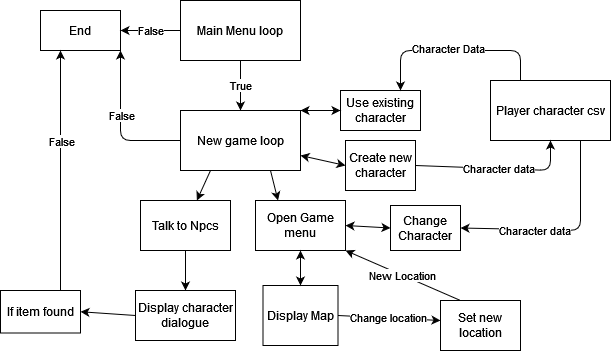

# **NathanEwan_T1A3 - Terminal Application: Role Playing Game**

## **Links**

### Github Repository: https://github.com/NathanEwan02/NathanEwan_T1A3

### Trello Board: https://trello.com/b/RYC8wiAs/terminal-app <br></br>

# **Software Development Plan**

## **Description and Functionality**

The application that has been developed is a simple turn-based roleplaying game designed to be playable through the use of a terminal. The game begins with the player creating a character to play as. Once a character has been created, the player is prompted with a game map and its locations. The player is then given the option to pick a specific location on the map to travel to. When the player arrives at the location they have chosen, the game provides the option to interact with the different Non-playable characters (NPCs) within that location and provides the player with dialouge options. The overall Goal of the game is to locate a specific item called the 'Holy Sandwich', which once found will end the game.

## **Problem and Target Audience**
The main problem I wish to solve as a result of creating this application is boredom. As a result of the COVID-19 pandemic people have more free time and are not able to fill this time with any outdoor activities. To solve this terminal application will provide the users with an activity to keep them entertained.

The Target audience of the application is as stated before people who are bored and looking for a means of entertainment. The simplicity of the game would also serve as a sufficient introduction for childeren into Roleplaying Games.

## **Use**
As described before the game is an RPG in which the player is tasked with finding an item. To go into more detail however, the user will first encounter a main menu page in which they are provided with three options, 'new game', 'options', and exit game. The exit game option sets the main menu loop to false and exits the user out, while the options will provide the user with information on how to access command line arguments to gain help, or skip to the game. The new game option is what begins the game. Before the game begins however, The user must choose to create a new charcter or choose to use an existing one. If the player chooses to use an existing charcter they are provided with options from a csv file which displays different characters available for them to select. If the player chooses instead to create a character, then they provide the name, race ('human', 'elf'), and the charcter type, which are displayed to the user using tty prompt commands. Once this has been completed the game begins and the player begins in a set location. They are given options to talk/interact with the different npcs in this location or to access the game menu. If the player has chosen to talk the npcs, the player is given an introduction by the character and then provided with the options to choose how to respond. Each npc will give hints toward where the player can go next to find the item. When the player access the game menu they can access the map to travel to a different location, and three other options, exit menu, exit game and change character name.

# **Features**

## **Character Creator**
The character Creator Feature is designed so that when starting a new game, a player is provided with the option to either create a new character or use an existing one. In the case that a player chooses to use an existing character, the player be provided with a list of all the characters available in the player.csv file. The game will take the input directly from the player and use the input to search for that name in the csv file. If the name provided by the player is not in the csv file then the game will return an error. The player also has the options to create a new character however, and in this case the player is provided with tty prompts to choose the name, race and character type of the player. Once it has been set, an instance of a class is created with these attributes. 

## **Traveling Using Game Map**
Within the game the player is always able to acess the game menu, which is a part of game map feature. Inorder to access the game map the player must select the 'Map menu' option provided via tty prompt. Once the player is on the map menu screen, a function is used to display the different towns they are able to travel to. With the use of a 'visited location' variable and an 'unvisited location' variable the map menu takes into account if the player is already in this location. If they are then the terminal tells the player that they are already there. If the player chooses to travel to an unvisited location, then the value of the two variables are swapped. Once a player is in a new location they are able to access different NPCs.

## **Charcter Dialouge**
A significant part of the game is being able to interact with the different NPCs (non-playable characters) available within in a given location. Each of these NPCs are given a name, introduction, and two responses when initialising them using the NPC class. When the player is interacting with each NPC they are required to store these values so that each are unique in their response and can be changed later on. This is vital because each NPC needs to give a different hint than the last when the player is talking to them, to find the main item of the game.

# **Interaction and Experience**

## **Using Features**
When using the different features within the game it is essential that each player can access a set of instructions or a help guide. Inorder to help serve user experience, documentation of this app can be accessed in the 'help documentaion' below, which serves to provide information on how to install the application and any dependencies that may be required. In addition to this, help on instructions within the game can be accessed through command line arguments by typing 'ruby main.rb --g' to access a guide on the rules and objective of the game. The features have also been created to be self explanatory and easy to undestand.

When using the features of the game, the player is often prompted before hand on what to input and how. For example, the TTY prompt gem allows for the player to use arrow keys inorder to select which option they wish to choose. This is also provided with a statment before hand exlaining what the player needs to choose, and for what purpose. Additionally, the tty prompt provides instructions on how to select an item. As for features that do not have a tty prompt to access the items, the player is still provided with clear instructions on what input is to be expected from them. 

## **Error Handling**
Most inputs required from the player are accessed using arrow keys, thus drastically minimizing the need for error handling when using tty prompt methods. In addition to this, tty prompt also provides developers with access to methods that check for capitilization, missing spaces and incorrect data types. As for the inputs that do not use the prompt methods, these inputs will be cheacked to ensure they are of the correct data type and display an appropriate error to the user explaning what went wrong. 

# **Control Flow**



# **Implementation**

## **Character Creation**

- Main Menu Loop (1hrs)
    - Create a function that creates a title so that it can be reused in the loop
    - create the while loop 
    - Make a function that can be accessed outside of the loop that takes in arguments to create a tty prompt
    - Use the prompt function to create the new game, options, and exit
    - Create if statments for the tty prompts
    - Create csv file and use the to read when creating a character or choosing an existing one
    - Create two if statments one for choosing a character and one for creating a new one
- Make a Character class (2hrs)
    - Initialise instance variables for name, race and character type
    - create a class method to display all the tty prompt options to the player for name, race and character type
    - Create a method to initialize the variables into an instance of the character class
- CSV file (1hrs)
    - Read the csv file to get access to all available characers
    - use find method to locate values associated with the name the user inputed and create an instance
    - Use character class methods to create a new player variable

## **Interacting with NPCs**
- Create a Game Loop (30mins)
    - Create variables for current location and unvisited location
    - Make if statments within the game loop for game menu and talking to npcs
- Make an NPC class (2hrs)
    - Create an NPC class
    - Initialise npcs with an introduction, name, and two responses
    - Create methods in npc class to display a tty prompt
    - create a method inside the npc class to output the correct response 

## **Using Map**
- Create a map class (30mins)
    - initialize the map names and the npcs within the map
    - Create variables to be checked if the player is in that location
- Make a Game Menu loop (2hrs)
    - Make a game menu loop inside the Main Menu loop
    - create tty prompts for Map, Character options, Back, and Exit game
    - Create if statments for each prompt
    - Change map location using current variable and invisited variable
    - Check if map location is unvisited
    - Print error if player is already in the location

# **Help Documentation**

## **To Install App**
Follow the below steps:

1. Download the folder NathanEwan_T1A3 from github repo and unzip the folder
2. Navigate to the src folder and can optionally use 'bundle install' if not already installed

## **To Play The Game**
1. Change directories into src 
```
cd (path to src file)
for example:
cd Documents/games/terminal_app/src
```
2. To run the Game use the './run_app.sh' script file
```
./run_app.sh
```
## **Dependancies**

- TTY Prompt
    - Link: https://github.com/piotrmurach/tty-prompt#ttyprompt-
    - A gem used to provide the user with prompts and use the arrow keys to navigate between them
- Artii 
    - Links: https://github.com/miketierney/artii/
    - A gem used to display ascii art titles
- Rainbow
    - Link: https://github.com/sickill/rainbow
    - Gen used to give colour to text

## **Helpful CLI**
There are three command line arguments you can use within the application:

- '-n' or '--new' after typing 'ruby main.rb' will allow the player to skip the main menu and get straight to the game
- '-h' or --help' after typing 'ruby main.rb' will give user a list of helpful commands they can access
- '-g' or --guid' after typing 'ruby main.rb' will give the player instructions on how to play the game

Use these commands when you needed, Have fun!


    
